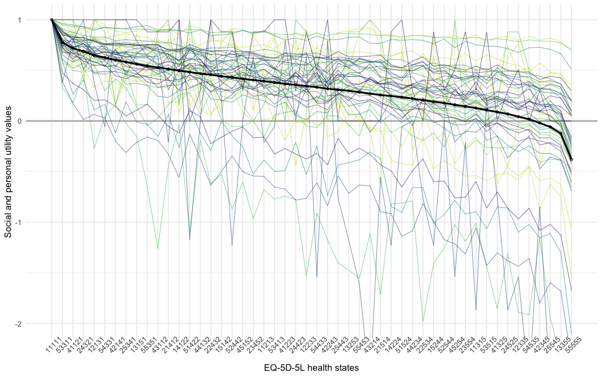

# OPUF SOURCE CODE

This repository contains the R source code for the publication:

#### **"The Online Elicitation of Personal Utility Functions (OPUF) tool: a new method for valuing health states"**

Paul Schneider1, Ben van Hout1,2, Marieke Heisen3, John Brazier1, Nancy Devlin4

1ScHARR, University of Sheffield, UK; 2OPEN Health, York, UK; 3OPEN Health, Rotterdam, NL; 4MSPGH, University of Melbourne, AU

doi: ...

****

`./shiny/` contains the R shiny source code for the OPUF survey application

`./analysis/` contains a demo analysis of survey data

