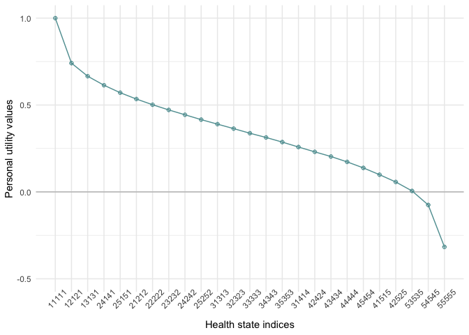

## Demo analysis of OPUF survey responses

**Paul Schneider**
University of Sheffield
11 December 2021

This document gives a short demo of how personal utility functions are constructed from OPUF survey responses.

The code is taken from the `opuf_analysis.R` file.

------------------------------------------------------------------------

Load the demo survey data
-------------------------

    dat = readRDS("./demo_data.RDS")

    # load descriptive system functions
    source("./R/ds.R")                # general function to create descriptive system (ds) 
    source("./R/ds_placeholder.R")    # placeholder ds with generic labels

    ds = placeholderGen()
    ds_expanded = dsExpand(ds)

Survey response data details
----------------------------

the loaded data contains the user’s responses to each task

    names(dat)

    ##  [1] "rateOwn_res"      "rateOwn_vas"      "lvlRate"          "dimRank"         
    ##  [5] "swingRate"        "anyDCE"           "dce_quants"       "dce_difficulties"
    ##  [9] "hs_eq_dead"       "deadDCE_trail"    "dead_vas_hs"      "dead_vas_value"  
    ## [13] "survey_res"       "tab_times"

1.  own health state (unordered)

<!-- -->

    unlist(dat$rateOwn_res)

    ##                                   rateOwn_D 
    ## "I have moderate problems with DIMENSION D" 
    ##                                   rateOwn_B 
    ##   "I have slight problems with DIMENSION B" 
    ##                                   rateOwn_A 
    ##       "I have no problems with DIMENSION A" 
    ##                                   rateOwn_E 
    ##       "I have no problems with DIMENSION E" 
    ##                                   rateOwn_C 
    ##       "I have no problems with DIMENSION C"

1.  VAS

<!-- -->

    dat$rateOwn_vas

    ## [1] 80

1.  level rating

<!-- -->

    names(dat$lvlRate) <- c("no","slight","moderate","severe","extreme")
    100 - dat$lvlRate

    ##       no   slight moderate   severe  extreme 
    ##      100       80       56       12        0

1.  dimension ranking (from ‘best’ to worst)

<!-- -->

    dat$dimRank

    ## [1] "B" "A" "E" "C" "D"

1.  dimension swing weigthing (unorderd)

<!-- -->

    dat$swingRate

    ## $swingRate_C
    ## [1] 59
    ## 
    ## $swingRate_B
    ## [1] 100
    ## 
    ## $swingRate_A
    ## [1] 89
    ## 
    ## $swingRate_E
    ## [1] 82
    ## 
    ## $swingRate_D
    ## [1] 44

1.  validation DCE responses

<!-- -->

    # choice scenarios and choices
    dat$anyDCE

    ##   A_mo A_sc A_ua A_pd A_ad B_mo B_sc B_ua B_pd B_ad    
    ## 1 "2"  "4"  "1"  "3"  "2"  "5"  "2"  "4"  "3"  "3"  "B"
    ## 2 "5"  "3"  "1"  "4"  "2"  "4"  "4"  "4"  "1"  "5"  "A"
    ## 3 "4"  "5"  "2"  "2"  "3"  "5"  "4"  "2"  "2"  "1"  "A"

    # difficulty of the choice sets
    dat$dce_difficulties

    ## [1] 0.2 0.3 0.1

    # where on the utility scale does the choice set lie?
    dat$dce_quants

    ## [1] 0.75 0.50 0.25

1.  DeadDce (position of dead task)

<!-- -->

    # choice trail
    dat$deadDCE_trail

    ## [1] "BAAABA"

    # the health state that was identified as being approx. equal to being dead:
    dat$hs_eq_dead

    ## [1] 5 4 4 4 2

1.  deadVAS (if applicable)

<!-- -->

    dat$dead_vas_hs

    ## NULL

1.  demographic survey responses (unordered)

<!-- -->

    dat$survey_res

    ## $survey_select_religious_practice
    ## [1] "A few times a year"
    ## 
    ## $survey_select_education
    ## [1] "Degree"
    ## 
    ## $survey_radio_health_experience
    ## [1] "Someone in my family has or had severe health problems."
    ## [2] "I work in the healthcare sector."                       
    ## 
    ## $survey_select_age
    ## [1] "35-39 years old"
    ## 
    ## $survey_radio_sex
    ## [1] "Male"
    ## 
    ## $survey_select_nationality
    ## [1] "English "      "European/EEA "
    ## 
    ## $survey_select_work
    ## [1] "Employed or self−employed"
    ## 
    ## $survey_select_income
    ## [1] ""
    ## 
    ## $survey_radio_birthcountry
    ## [1] "Yes"
    ## 
    ## $survey_ptns_age
    ## [1] FALSE
    ## 
    ## $survey_ptns_income
    ## [1] TRUE
    ## 
    ## $survey_radio_children
    ## [1] "Yes"
    ## 
    ## $survey_select_partner
    ## [1] "Married/Civil partnered/Living together"
    ## 
    ## $survey_select_faith
    ## [1] "Slightly important"

1.  time stamps

<!-- -->

    dat$tab_times

    ## $`2_Subjective health status`
    ## [1] "2021-12-11 11:19:01 CET"
    ## 
    ## $`3_Level Rating`
    ## [1] "2021-12-11 11:19:03 CET"
    ## 
    ## $`8_Results page`
    ## [1] "2021-12-11 11:19:58 CET"
    ## 
    ## $`1_Self-reported health status`
    ## [1] "2021-12-11 11:18:53 CET"
    ## 
    ## $`6_Life & Death`
    ## [1] "2021-12-11 11:19:28 CET"
    ## 
    ## $`4_Dimension Ranking`
    ## [1] "2021-12-11 11:19:06 CET"
    ## 
    ## $`5_Dimension Weighting`
    ## [1] "2021-12-11 11:19:15 CET"
    ## 
    ## $`6_Health States Choices`
    ## [1] "2021-12-11 11:19:25 CET"
    ## 
    ## $`6_Survey`
    ## [1] "2021-12-11 11:19:32 CET"
    ## 
    ## $`0_Welcome`
    ## [1] "2021-12-11 11:18:52 CET"

      # check duration per task
      tab_times <- unlist(dat$tab_times)
      tab_times <- tab_times[order(tab_times)]
      tab_names <- names(tab_times)
      tab_names <- gsub('[0-9]+[_]', "", tab_names)
      tab_names <- unique(tab_names)
      tab_times <- diff(tab_times) # NB: if user revisits a page, times need to be aggregated
      names(tab_times) = tab_names[-length(tab_names)]
      round(tab_times) # in seconds (as you can see, this was a very quick run through)

    ##                     Welcome Self-reported health status 
    ##                           1                           8 
    ##    Subjective health status                Level Rating 
    ##                           2                           3 
    ##           Dimension Ranking         Dimension Weighting 
    ##                           9                          10 
    ##       Health States Choices                Life & Death 
    ##                           3                           4 
    ##                      Survey 
    ##                          26

      round(sum(tab_times) / 60,1) # in minutes

    ## [1] 1.1

Constructing a Personal Utility Function (PUF)
----------------------------------------------

**1)  1-0 Scaled PUF**

<!-- -->

    dim_order <- c("A","B","C","D","E")
    lvls_labels <- c("no","slight","moderate","severe","extreme")

    d_weights <- unlist(dat$swingRate) / 100
    names(d_weights) <- gsub("swingRate_","",names(d_weights))
    d_weights <- d_weights[match(dim_order, names(d_weights))]

    l_scores = dat$lvlRate / 100
    l_scores = 1 - l_scores # recode as utilities rather than disutilities

    # 1-0 scaled coefficient matrix
    scaled_mat = matrix(unlist(lapply(l_scores, function(x) x * d_weights)), ncol = 5, byrow = T)
    colnames(scaled_mat) <- dim_order
    rownames(scaled_mat) <- lvls_labels
    scaled_mat

    ##               A    B      C      D      E
    ## no       0.8900 1.00 0.5900 0.4400 0.8200
    ## slight   0.7120 0.80 0.4720 0.3520 0.6560
    ## moderate 0.4984 0.56 0.3304 0.2464 0.4592
    ## severe   0.1068 0.12 0.0708 0.0528 0.0984
    ## extreme  0.0000 0.00 0.0000 0.0000 0.0000

    # assigning a 1-0 scaled value to 
    # all health state in the descriptive system
    ds_expanded_collapsed <- apply(ds_expanded, 1, paste0, collapse = "")
    scaled_vals = c(0)
    for (j in 1:ncol(ds_expanded)) {
      scaled_vals = scaled_vals + scaled_mat[ds_expanded[, j], j]
    }
    scaled_vals = scaled_vals / max(scaled_vals)
    names(scaled_vals) = ds_expanded_collapsed

    # the best health state (level 1 on all 5 dimensions) has a value of 1
    head(scaled_vals)

    ##     11111     21111     31111     41111     51111     12111 
    ## 1.0000000 0.9524064 0.8952941 0.7905882 0.7620321 0.9465241

    # the worst health state (level 5 on all 5 dimensions) has a value of 0
    tail(scaled_vals)

    ##      54555      15555      25555      35555      45555      55555 
    ## 0.03208556 0.23796791 0.19037433 0.13326203 0.02855615 0.00000000

**2) Anchored PUF**

Map scaled values on to the utility scale with:

-   1 = Full health
-   0 = Being dead
-   Negative values = states worse than dead

<!-- -->

    # ALTERNATIVE A: if anchoring via 'position of dead':
      dead_equal = paste0(dat$hs_eq_dead, collapse = "")
      val_hs_eq_dead = ds_expanded_collapsed == dead_equal 
      scale_d = scaled_vals[1] - scaled_vals[val_hs_eq_dead]
      values_d = scaled_vals - scaled_vals[val_hs_eq_dead]
      anchored_values = (values_d / scale_d)
      
      # now best health state has a value of 1
      head(anchored_values)

    ##     11111     21111     31111     41111     51111     12111 
    ## 1.0000000 0.9373328 0.8621321 0.7242642 0.6866639 0.9295874

      # and the worst health state has a value of -0.32
      tail(anchored_values)

    ##        54555        15555        25555        35555        45555        55555 
    ## -0.274468385 -0.003379806 -0.066047036 -0.141247712 -0.279115618 -0.316715955

    # # ALTERNATIVE B: if anchoring via 'dead VAS task':
    #   val_pit = dat$dead_vas_hs 
    #   # val_pit = 1.5  # # example: user sets '55555' to a value of 15 of 100 
    #   pit_index = length(scaled_vals)
    #   scale_t = (1-(val_pit/10))/(1-scaled_vals[pit_index])
    #   values_d = (1 - scaled_vals)*scale_t
    #   anchored_values = 1-values_d

**Predict the value of a particular health state**

    pred_hs = "12345"
        hs_index = match(pred_hs,ds_expanded_collapsed)
        anchored_values[pred_hs]

    ##     12345 
    ## 0.4131812

**Check user’s consistency in DCE tasks**

    # predict value of DCE choice sets
      hs_a <- apply(dat$anyDCE[,1:5], 1, paste0, collapse = "")
      hs_index_a = match(hs_a,ds_expanded_collapsed)
      pred_a = anchored_values[hs_index_a]
      
      hs_b <- apply(dat$anyDCE[,6:10], 1, paste0, collapse = "")
      hs_index_b = match(hs_b,ds_expanded_collapsed)
      pred_b = anchored_values[hs_index_b]
      
      # predicted choices
      pred_choices = c("A","B")[as.numeric(pred_a > pred_b)+1]
      pred_choices

    ## [1] "B" "B" "A"

      # actual choices
      dat$anyDCE[,11]

    ##   1   2   3 
    ## "B" "A" "A"

**Visualise a PUF**

        library(ggplot2)
        
        # limit the number of health states to 25
        sample_hs <- round(seq(1,length(anchored_values), length.out = 25))
        hs_ranks = rank(-anchored_values, ties.method = "random")
        indices = hs_ranks %in% sample_hs
        
        ggplot() +
          geom_hline(yintercept = 0, size = 0.5, color = "gray") +
          geom_point(aes(x = hs_ranks[indices], y= anchored_values[indices]),shape = 10, col = "cadetblue", fill ="red") +
          geom_line(aes(x = hs_ranks[indices], y= anchored_values[indices]), col = "cadetblue")  +
          scale_x_continuous(
            breaks = sample_hs, 
            labels = ds_expanded_collapsed[sample_hs], 
            minor_breaks = NULL, name = "Health state indices") +
          ylab("Personal utility values") +
          theme_minimal()+ 
          scale_color_viridis_b(begin = 1,end = 0) +
          coord_cartesian(ylim=c(-0.5,1)) +
          theme(legend.position = "none", axis.text.x = element_text(angle = 45))

